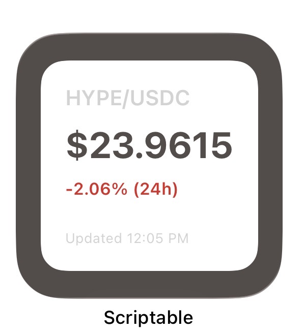

# HYPE/USDC Spot Price Widget

An iOS widget that displays real-time HYPE/USDC spot prices from Hyperliquid's Layer 1. Built with Scriptable for easy customization and deployment.



## What It Does

Connects directly to Hyperliquid's public API to fetch and display the current spot price for HYPE/USDC. The design features a clean, minimal interface with a white rounded card on a darker background that fits naturally on your home screen.

**Features:**
- Current HYPE/USDC spot price with four decimal precision
- 24-hour price change percentage with color-coded indicators (green for positive, red for negative)
- Last update timestamp showing when the data was fetched
- Price alert notifications when price crosses configured thresholds
- 24-hour change alerts for significant price movements
- Tap to refresh manually for instant data updates
- Clean card-based layout with rounded corners and subtle background contrast
- Fully customizable colors and styling through configuration variables

The widget updates automatically according to iOS scheduling (typically every 15 minutes), and you can manually refresh by opening the script in Scriptable. All data is fetched from public endpoints with no authentication required.

## Installation

**Requirements:** iPhone running iOS 14+ and the Scriptable app (free from App Store)

1. Download and install Scriptable from the App Store
2. Open Scriptable and tap the plus button to create a new script
3. Copy the entire contents of `spot_price.js` into the script editor
4. Tap the script name to rename it (e.g., "HYPE Price")
5. Tap Done to save

**Adding to Home Screen:**

1. Long-press on your home screen to enter edit mode
2. Tap the plus button in the top left corner
3. Search for "Scriptable" in the widget gallery
4. Select your preferred widget size (small, medium, or large)
5. Tap Add Widget to place it on your home screen
6. Long-press the newly added widget and select Edit Widget
7. Choose your "HYPE Price" script from the list

The widget should now appear on your home screen and begin fetching data.

**Notification Permissions:**

If you plan to use alert notifications, make sure Scriptable has notification permissions enabled. The first time the widget sends a notification, iOS will prompt you to allow notifications. Grant permission to receive price alerts.

## Usage

After installation, the widget will automatically update every 15 minutes or so. You can manually refresh the widget by tapping on it, which will open Scriptable and run the script to fetch fresh data.

The widget displays the current HYPE/USDC spot price, 24-hour change percentage, and last update time. All data is fetched from Hyperliquid's public API with no authentication required.

If alerts are enabled, the widget will send iOS notifications when price thresholds are crossed or when significant 24-hour price changes occur. Notifications respect a cooldown period to prevent spam.

## Configuration

The widget is highly customizable through variables defined at the top of the script file. You can modify colors, enable or disable features, and configure custom branding.

**1. Color Customization**

The color palette is defined in the `COLORS` object at the top of the script:

```javascript
var COLORS = {
  'bg': new Color('#544C4A'),           // Brownish dark gray background
  'card': new Color('#FFFFFF'),         // White card
  'green': new Color('#059669'),         // Green for positive changes
  'red': new Color('#DC2626'),          // Red for negative changes
  'text': new Color('#D3D3D3'),         // Light gray text
  'accent': new Color('#E5E7EB'),       // Light gray accent
  'price': new Color('#544C4A'),         // Brownish dark gray for price
  'secondary': new Color('#D3D3D3')     // Light gray for secondary text
};
```

Adjust these hex values to match your preferred color scheme.

**2. Custom Logo or Image**

The widget supports custom images for branding. Configure it using one of these methods:

Method 1: Remote Image URL

```javascript
var CUSTOM_IMAGE_URL = 'https://your-domain.com/logo.png';
```

Method 2: Local Image File

```javascript
var CUSTOM_IMAGE_LOCAL = 'logo.png';
```

Save your image file to Scriptable's iCloud folder (accessible through the Files app). The widget will attempt to load the image if configured, falling back gracefully if the image cannot be loaded.

**3. Layout Options**

```javascript
var USE_GRADIENT_BG = false;  // Set to true for gradient backgrounds
var USE_CARD_LAYOUT = true;   // Card layout is currently enabled
```

The card layout wraps all content in a white rounded rectangle with padding. The gradient background option is available but currently disabled in favor of a solid background color.

**4. Alert Configuration**

The widget includes a notification system for price alerts. Configure alerts at the top of the script:

```javascript
var ALERTS = {
  enabled: true,                    // Master switch for all alerts
  
  // Price threshold alerts
  priceAlerts: {
    enabled: true,
    upperThreshold: 30.00,          // Alert when price goes ABOVE this
    lowerThreshold: 20.00,          // Alert when price goes BELOW this
  },
  
  // 24-hour change alerts
  changeAlerts: {
    enabled: true,
    positivePercent: 10,            // Alert if price up more than 10%
    negativePercent: -10            // Alert if price down more than 10%
  },
  
  // Cooldown to prevent spam (minutes)
  cooldownMinutes: 15
};
```

Set `enabled: false` to disable all alerts, or disable individual alert types by setting their `enabled` property to `false`. Adjust the threshold values to match your desired price levels and change percentages. The cooldown prevents multiple notifications within the specified time period.

When alerts are enabled, the widget displays the current alert status in the widget itself, showing whether the price is above, below, or within the configured threshold range.

**5. Tracking Other Spot Pairs**

While this widget is configured for HYPE/USDC, you can modify it to track other spot pairs on Hyperliquid:

```javascript
var HYPE_PAIR_ID = '@107';
```

HYPE/USDC uses the identifier `@107` on mainnet. To find other pairs, check Hyperliquid's spot metadata endpoint and look for the index number associated with your desired trading pair. Replace the `HYPE_PAIR_ID` value in the script with the appropriate identifier.

Some pairs may use different formats. For example, PURR/USDC uses the string identifier `PURR/USDC` rather than an index-based format. You'll also need to update the `SPOT_PAIRS` object if you want to track multiple pairs.

## Limitations

**1. Update Frequency**

iOS controls when widgets refresh. The system typically updates widgets every 15 minutes or so, but this isn't guaranteed. You can't force more frequent updates from within the widget itself.

**2. No Real-Time Updates**

This is an iOS limitation, not a limitation of the widget code. For truly real-time price data, you'd need to use the Hyperliquid web app or mobile app directly.

**3. Manual Refresh**

You can manually refresh the widget by opening the script in Scriptable and running it. This bypasses iOS scheduling and fetches fresh data immediately.

**4. Network Dependency**

The widget requires an active internet connection to fetch data. If you're offline, it will display "N/A" for the price.

## Troubleshooting

**1. Widget Shows "N/A" for Price**

This usually means the widget couldn't fetch data from the API. Common causes:
- No internet connection
- Hyperliquid API is temporarily unavailable
- Network timeout

Try running the script directly in Scriptable to see if there are any error messages. Check your internet connection and try again.

**2. Widget Not Updating**

iOS controls widget refresh timing. If your widget seems stale:
- Wait for the next automatic refresh (can take 15+ minutes)
- Manually refresh by opening the script in Scriptable
- Remove and re-add the widget to force a refresh

**3. Syntax Errors When Pasting Code**

If you encounter syntax errors:
- Make sure you're copying the entire file contents
- Create a fresh script rather than editing an existing one
- Check for any hidden formatting characters that might have been copied
- Verify the file encoding is correct

**4. Colors Not Displaying Correctly**

If colors appear wrong or hard to read:
- Check that the hex color values are properly formatted
- Ensure there's sufficient contrast between text and background colors
- The current palette uses a brownish dark gray background with light gray text for optimal contrast

## Contributing

Contributions welcome. If you find bugs, have feature suggestions, or want to improve the code, feel free to open an issue or submit a pull request.

When contributing:
- Follow the existing code style
- Test your changes in Scriptable before submitting
- Update documentation if you add new features
- Keep the code readable and well-commented

## License

MIT License

## Disclaimer

This widget is an independent project and is not affiliated with, endorsed by, or associated with Hyperliquid. Use at your own risk. Always verify prices and trading information on the official Hyperliquid platform before making any trading decisions. The authors and contributors are not responsible for any losses or damages resulting from the use of this widget.

## Resources

- [Hyperliquid API Documentation](https://hyperliquid.gitbook.io/hyperliquid-docs/for-developers/api): Complete API reference
- [Scriptable Documentation](https://docs.scriptable.app/): Scriptable API and widget development guide
- [Hyperliquid Web App](https://app.hyperliquid.xyz/): Official Hyperliquid trading interface
