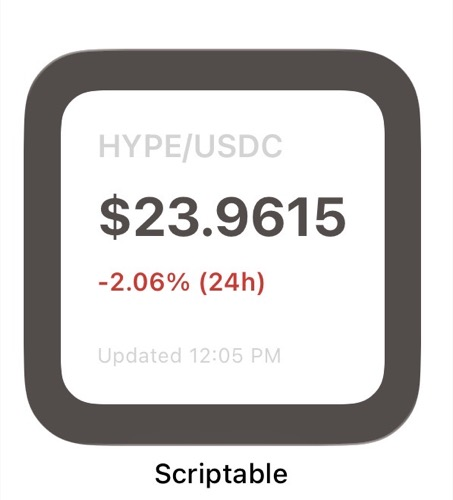

# HYPE/USDC Spot Price Widget

An iOS widget that displays HYPE/USDC spot prices from Hyperliquid's Layer 1. Built with Scriptable.



## What It Does

This widget connects directly to Hyperliquid's public API to fetch and display the current spot price for HYPE/USDC. It updates automatically according to iOS scheduling (typically every 15 minutes), but you can manually refresh it with a single tap. All data is fetched from public endpoints with no authentication required.

**Notable Features:**
- HYPE/USDC spot price with four decimal precision
- 24-hour price change percentage 
- Configurable price alert notifications 

## Installation

**Requirements:** Scriptable && iOS 15.5 or later

1. Download and install Scriptable from the App Store
2. Open Scriptable and tap the plus button to create a new script
3. Copy the entire contents of `spot_price.js` into the script editor
4. Tap the script name to rename it (e.g., "HYPE Price")
5. Tap Done to save

**Adding to Home Screen:**

1. Long-press on your home screen to enter edit mode
2. Tap the plus button in the top left corner
3. Search for "Scriptable" in the widget gallery
4. Select your preferred widget size (small, medium, or large)
5. Tap Add Widget to place it on your home screen
6. Long-press the newly added widget and select Edit Widget
7. Choose your "HYPE Price" script from the list

The widget should now appear on your home screen and begin fetching data.

**Notification Permissions:**

If you plan to use alert notifications, make sure Scriptable has notification permissions enabled. The first time the widget sends a notification, iOS will prompt you to allow notifications. Grant permission to receive price alerts.

## Usage

After installation, the widget will automatically update every 15 minutes or so. You can manually refresh the widget by tapping on it, which will open Scriptable and run the script to fetch fresh data.

The widget displays the current HYPE/USDC spot price, 24-hour change percentage, and last update time. All data is fetched from Hyperliquid's public API with no authentication required.

If alerts are enabled, the widget will send iOS notifications when price thresholds are crossed or when significant 24-hour price changes occur. Notifications respect a cooldown period to prevent spam.

## Configuration

**1. Alert Configuration**

The widget includes a notification system for price alerts. Configure alerts at the top of the script:

```javascript
var ALERTS = {
  enabled: true,                    // Master switch for all alerts
  
  priceAlerts: {
    enabled: true,
    upperThreshold: 30.00,          // Alerts when price goes above this
    lowerThreshold: 20.00,          // Alerts when price goes below this
  },
  
  changeAlerts: {
    enabled: true,
    positivePercent: 10,            // Alerts if price goes up by more than 10%
    negativePercent: -10            // Alerts if price goes down by more than 10%
  },
  
  cooldownMinutes: 15
};
```

Set `enabled: false` to disable all alerts, or disable individual alert types by setting their `enabled` property to `false`. Adjust the threshold values to match your desired price levels and change percentages. The cooldown prevents multiple notifications within the specified time period.

**2. Color Customization**

```javascript
var COLORS = {
  'bg': new Color('#544C4A'),           // Brownish dark gray background
  'card': new Color('#FFFFFF'),         // White card
  'green': new Color('#059669'),         // Green for positive changes
  'red': new Color('#DC2626'),          // Red for negative changes
  'text': new Color('#D3D3D3'),         // Light gray text
  'accent': new Color('#E5E7EB'),       // Light gray accent
  'price': new Color('#544C4A'),         // Brownish dark gray for price
  'secondary': new Color('#D3D3D3')     // Light gray for secondary text
};
```

Adjust these hex values to match your preferred color scheme.

**3. Layout Options**

```javascript
var USE_GRADIENT_BG = false;  // Set to true for gradient backgrounds
var USE_CARD_LAYOUT = true;   // Card layout is currently enabled
```

The card layout wraps all content in a white rounded rectangle with padding. The gradient background option is available but currently disabled in favor of a solid background color.

## Limitations

**1. Update Frequency**

iOS controls when widgets refresh. The system typically updates widgets every 15 minutes or so in an automated fashion, but this is not guaranteed. 

That said, the widget can be refreshed manually by tapping it. This bypasses iOS scheduling and fetches fresh data immediately.

**2. No Real-Time Updates**

This is an iOS limitation, not a limitation of the widget code. For truly real-time price data, there is a need to use the Hyperliquid web app directly.

**3. Network Dependency**

The widget requires an active internet connection to fetch data. When offline, it will display "N/A" for the price.

## Contributing

Contributions are welcome! If you find bugs, have feature suggestions, or want to improve the code, feel free to open an issue or submit a pull request.

When contributing, please:
- Test your changes in Scriptable before submitting
- Update documentation if you add new features
- Keep the code readable and well-commented

## License

MIT License

## Disclaimer

This widget, born out of my own interest, is not affiliated with, endorsed by, or associated with Hyperliquid. Use at your own risk. Always verify prices and trading information on the official Hyperliquid platform before making any trading decisions. The author and contributors are not responsible for any losses or damages resulting from the use of this widget.

## Resources

- [Hyperliquid API Documentation](https://hyperliquid.gitbook.io/hyperliquid-docs/for-developers/api): Complete API reference
- [Scriptable Documentation](https://docs.scriptable.app/): Scriptable API and widget development guide
- [Hyperliquid Web App](https://app.hyperliquid.xyz/): Official Hyperliquid trading interface
